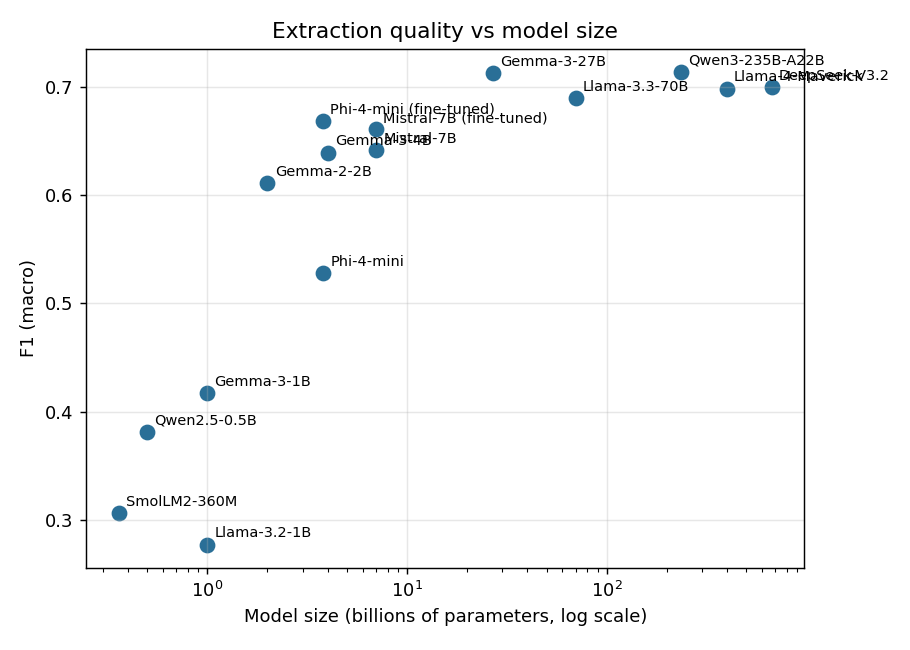
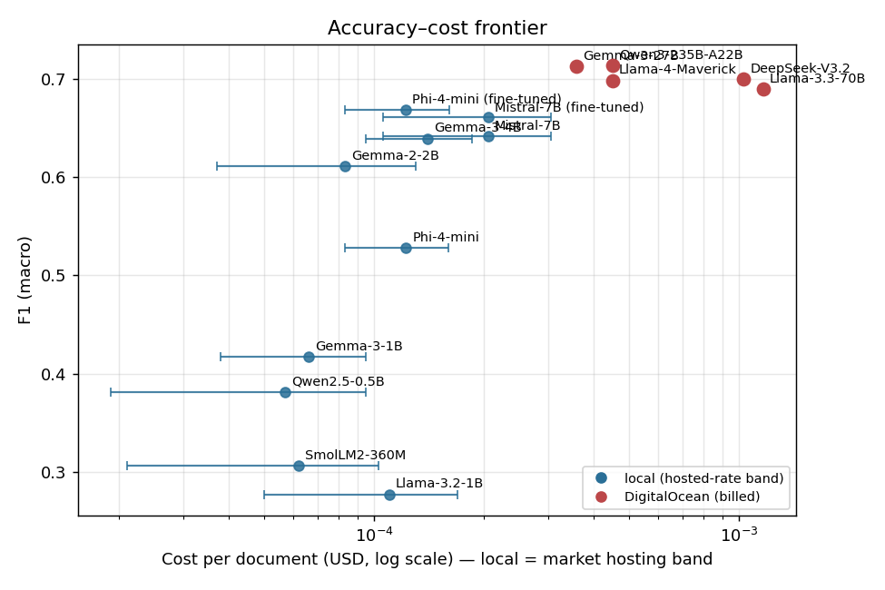
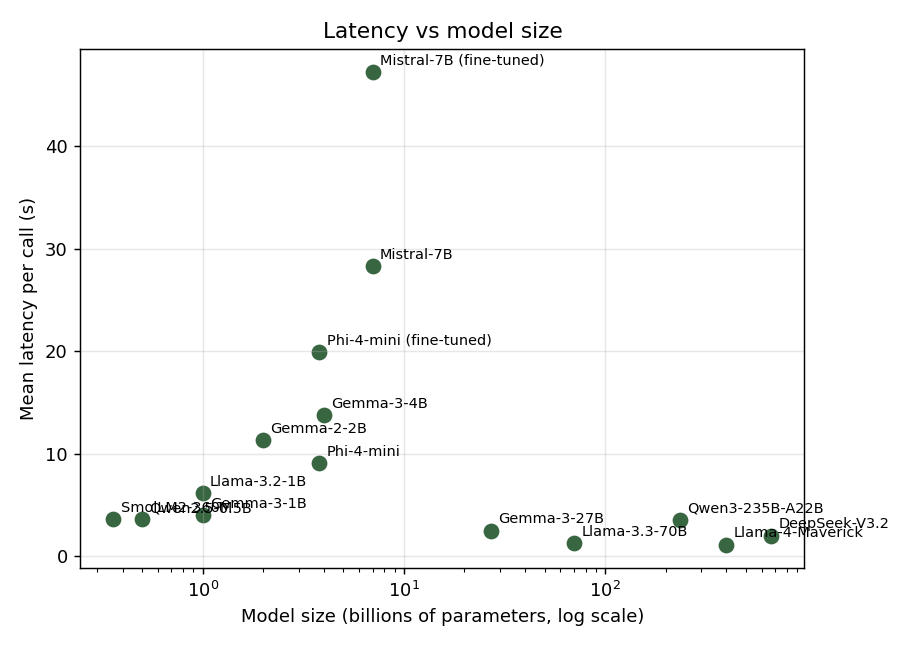
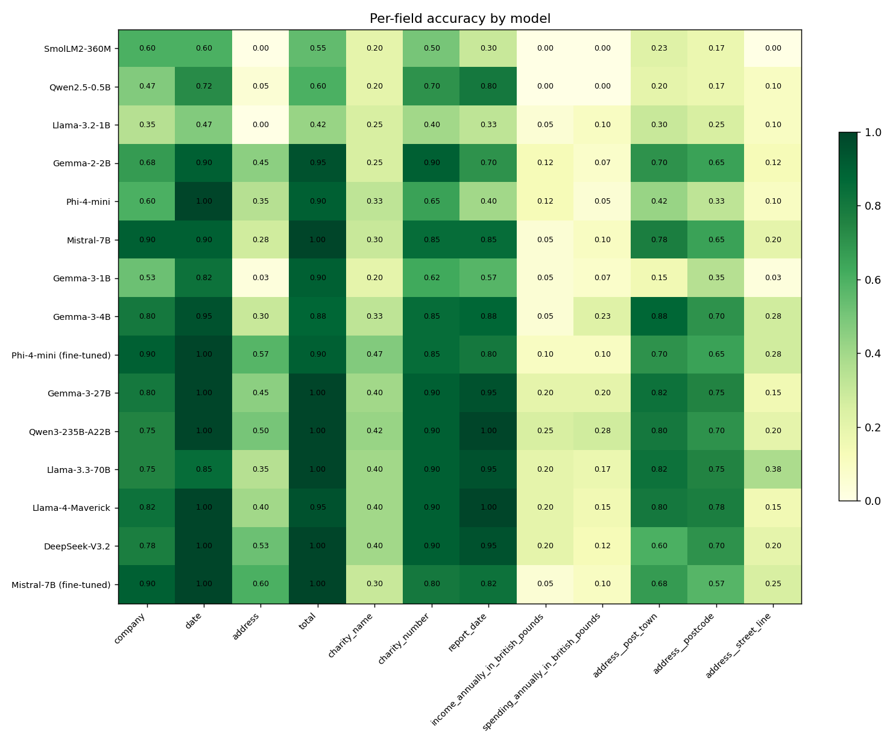

# SLM vs LLM — Key Information Extraction: Results

## Per-model summary

| model_id        | display_name            | model_type   |   params_b |   f1_macro |   f1_zero_shot |   f1_few_shot |   f1_micro |   precision |   recall |   exact_match_rate |   latency_s |   peak_mem_mb |   cost_usd_per_doc |   cost_low_per_doc |   cost_high_per_doc |   cost_mid_per_doc |   parse_fail_rate |
|:----------------|:------------------------|:-------------|-----------:|-----------:|---------------:|--------------:|-----------:|------------:|---------:|-------------------:|------------:|--------------:|-------------------:|-------------------:|--------------------:|-------------------:|------------------:|
| smollm2-360m    | SmolLM2-360M            | local        |       0.36 |     0.3062 |         0.35   |        0.2625 |     0.2625 |      0.2625 |   0.2625 |             0      |       3.604 |        1161.5 |           0        |           2.1e-05  |            0.000103 |           6.2e-05  |                 0 |
| qwen2.5-0.5b    | Qwen2.5-0.5B            | local        |       0.5  |     0.381  |         0.337  |        0.425  |     0.359  |      0.3861 |   0.3354 |             0      |       3.564 |        1467.7 |           0        |           1.9e-05  |            9.5e-05  |           5.7e-05  |                 0 |
| llama3.2-1b     | Llama-3.2-1B            | local        |       1    |     0.2771 |         0.5292 |        0.025  |     0.2611 |      0.2707 |   0.2521 |             0      |       6.149 |        1888.8 |           0        |           5e-05    |            0.000169 |           0.00011  |                 0 |
| gemma3-1b       | Gemma-3-1B              | local        |       1    |     0.4171 |         0.428  |        0.4062 |     0.3685 |      0.3769 |   0.3604 |             0.0125 |       4.013 |        1615.8 |           0        |           3.8e-05  |            9.5e-05  |           6.6e-05  |                 0 |
| gemma2-2b       | Gemma-2-2B              | local        |       2    |     0.6113 |         0.5729 |        0.6498 |     0.5804 |      0.625  |   0.5417 |             0.1125 |      11.315 |        2411.8 |           0        |           3.7e-05  |            0.00013  |           8.3e-05  |                 0 |
| phi4-mini       | Phi-4-mini              | local        |       3.8  |     0.5279 |         0.5866 |        0.4691 |     0.5097 |      0.6105 |   0.4375 |             0.125  |       9.059 |        3221.7 |           0        |           8.3e-05  |            0.00016  |           0.000122 |                 0 |
| phi4-mini-ft    | Phi-4-mini (fine-tuned) | local        |       3.8  |     0.6688 |         0.6875 |        0.65   |     0.6104 |      0.6104 |   0.6104 |             0.3125 |      19.92  |        3176.2 |           0        |           8.3e-05  |            0.000161 |           0.000122 |                 0 |
| gemma3-4b       | Gemma-3-4B              | local        |       4    |     0.6394 |         0.6467 |        0.6321 |     0.6075 |      0.6242 |   0.5917 |             0.0875 |      13.765 |        1510.2 |           0        |           9.5e-05  |            0.000185 |           0.00014  |                 0 |
| mistral-7b      | Mistral-7B              | local        |       7    |     0.6415 |         0.5777 |        0.7054 |     0.6069 |      0.6478 |   0.5708 |             0.1    |      28.315 |        4780.8 |           0        |           0.000106 |            0.000305 |           0.000205 |                 0 |
| mistral-7b-ft   | Mistral-7B (fine-tuned) | local        |       7    |     0.6609 |         0.6906 |        0.6312 |     0.5896 |      0.5896 |   0.5896 |             0.325  |      47.263 |        4720.6 |           0        |           0.000106 |            0.000305 |           0.000205 |                 0 |
| gemma3-27b      | Gemma-3-27B             | api          |      27    |     0.7128 |         0.7013 |        0.7242 |     0.694  |      0.7644 |   0.6354 |             0.2    |       2.479 |         nan   |           0.000358 |           0.000358 |            0.000358 |           0.000358 |                 0 |
| llama-70b       | Llama-3.3-70B           | api          |      70    |     0.6898 |         0.6269 |        0.7526 |     0.6841 |      0.7525 |   0.6271 |             0.1375 |       1.251 |         nan   |           0.001164 |           0.001164 |            0.001164 |           0.001164 |                 0 |
| qwen3-235b      | Qwen3-235B-A22B         | api          |     235    |     0.7137 |         0.6813 |        0.7462 |     0.6895 |      0.7341 |   0.65   |             0.225  |       3.509 |         nan   |           0.00045  |           0.00045  |            0.00045  |           0.00045  |                 0 |
| llama4-maverick | Llama-4-Maverick        | api          |     400    |     0.6984 |         0.6884 |        0.7085 |     0.6817 |      0.7438 |   0.6292 |             0.175  |       1.099 |         nan   |           0.00045  |           0.00045  |            0.00045  |           0.00045  |                 0 |
| deepseek-v3     | DeepSeek-V3.2           | api          |     671    |     0.7001 |         0.677  |        0.7232 |     0.6789 |      0.7584 |   0.6146 |             0.225  |       1.972 |         nan   |           0.001029 |           0.001029 |            0.001029 |           0.001029 |                 0 |

## Auto findings

- **Best quality:** `qwen3-235b` (F1 0.714).
- **Best free (local) model:** `phi4-mini-ft` (F1 0.669, $0/doc).
- **Quality gap (best API − best local):** +0.045 F1 — the price of going local.
- **Size trend:** F1 moves from 0.306 (smollm2-360m, 0.36B) to 0.700 (deepseek-v3, 671.0B).

## Per-condition detail

| model_id        | model_type   | shot_mode   | input_variant   |   n |   f1_macro_mean |   f1_macro_std |   f1_micro |   precision_micro |   recall_micro |   exact_match_rate |   latency_s_mean |   tokens_per_s_mean |   peak_mem_mb_mean |   cost_usd_per_doc |   parse_fail_rate |   missing |   hallucinated |
|:----------------|:-------------|:------------|:----------------|----:|----------------:|---------------:|-----------:|------------------:|---------------:|-------------------:|-----------------:|--------------------:|-------------------:|-------------------:|------------------:|----------:|---------------:|
| deepseek-v3     | api          | few_shot    | lines_only      |  20 |          0.7258 |         0.2231 |     0.7064 |            0.7857 |         0.6417 |               0.25 |            1.963 |               46.8  |              nan   |           0.001332 |                 0 |        22 |              0 |
| deepseek-v3     | api          | few_shot    | lines_plus_kv   |  20 |          0.7207 |         0.2225 |     0.6912 |            0.7732 |         0.625  |               0.25 |            1.9   |               47.59 |              nan   |           0.001344 |                 0 |        23 |              0 |
| deepseek-v3     | api          | zero_shot   | lines_only      |  20 |          0.6887 |         0.2315 |     0.6728 |            0.7526 |         0.6083 |               0.2  |            1.987 |               44.51 |              nan   |           0.000718 |                 0 |        23 |              0 |
| deepseek-v3     | api          | zero_shot   | lines_plus_kv   |  20 |          0.6652 |         0.213  |     0.6452 |            0.7216 |         0.5833 |               0.2  |            2.039 |               44.43 |              nan   |           0.000721 |                 0 |        23 |              0 |
| gemma2-2b       | local        | few_shot    | lines_only      |  20 |          0.6377 |         0.2175 |     0.6009 |            0.6195 |         0.5833 |               0.15 |           13.439 |                8.75 |             2401.8 |           0        |                 0 |         7 |              0 |
| gemma2-2b       | local        | few_shot    | lines_plus_kv   |  20 |          0.6619 |         0.2246 |     0.616  |            0.6239 |         0.6083 |               0.2  |           13.399 |                8.75 |             2573.7 |           0        |                 0 |         3 |              0 |
| gemma2-2b       | local        | zero_shot   | lines_only      |  20 |          0.5711 |         0.2268 |     0.5472 |            0.6304 |         0.4833 |               0.05 |           11.993 |                8.83 |             2469.8 |           0        |                 0 |        28 |              0 |
| gemma2-2b       | local        | zero_shot   | lines_plus_kv   |  20 |          0.5746 |         0.2231 |     0.5514 |            0.6277 |         0.4917 |               0.05 |            6.429 |               15    |             2201.8 |           0        |                 0 |        26 |              0 |
| gemma3-1b       | local        | few_shot    | lines_only      |  20 |          0.4188 |         0.2718 |     0.35   |            0.35   |         0.35   |               0.05 |            4.633 |               24.78 |             1624.3 |           0        |                 0 |         0 |              0 |
| gemma3-1b       | local        | few_shot    | lines_plus_kv   |  20 |          0.3938 |         0.228  |     0.3333 |            0.3333 |         0.3333 |               0    |            4.619 |               24.72 |             1639.7 |           0        |                 0 |         0 |              0 |
| gemma3-1b       | local        | zero_shot   | lines_only      |  20 |          0.4414 |         0.2129 |     0.4087 |            0.4273 |         0.3917 |               0    |            3.93  |               26.75 |             1598.6 |           0        |                 0 |        10 |              0 |
| gemma3-1b       | local        | zero_shot   | lines_plus_kv   |  20 |          0.4147 |         0.1982 |     0.3843 |            0.4037 |         0.3667 |               0    |            2.87  |               36.63 |             1600.9 |           0        |                 0 |        11 |              0 |
| gemma3-27b      | api          | few_shot    | lines_only      |  20 |          0.7217 |         0.205  |     0.7032 |            0.7778 |         0.6417 |               0.2  |            2.431 |               41.65 |              nan   |           0.000471 |                 0 |        21 |              0 |
| gemma3-27b      | api          | few_shot    | lines_plus_kv   |  20 |          0.7268 |         0.1979 |     0.7091 |            0.78   |         0.65   |               0.2  |            2.414 |               41.63 |              nan   |           0.000476 |                 0 |        20 |              0 |
| gemma3-27b      | api          | zero_shot   | lines_only      |  20 |          0.7013 |         0.2047 |     0.6818 |            0.75   |         0.625  |               0.2  |            2.575 |               47.08 |              nan   |           0.000242 |                 0 |        20 |              0 |
| gemma3-27b      | api          | zero_shot   | lines_plus_kv   |  20 |          0.7013 |         0.2047 |     0.6818 |            0.75   |         0.625  |               0.2  |            2.495 |               48.61 |              nan   |           0.000244 |                 0 |        20 |              0 |
| gemma3-4b       | local        | few_shot    | lines_only      |  20 |          0.6223 |         0.1915 |     0.5932 |            0.6034 |         0.5833 |               0.05 |           17.015 |                8.06 |             1510   |           0        |                 0 |         4 |              0 |
| gemma3-4b       | local        | few_shot    | lines_plus_kv   |  20 |          0.642  |         0.1967 |     0.6102 |            0.6207 |         0.6    |               0.05 |           17.247 |                7.76 |             1593.8 |           0        |                 0 |         4 |              0 |
| gemma3-4b       | local        | zero_shot   | lines_only      |  20 |          0.6316 |         0.212  |     0.6009 |            0.6195 |         0.5833 |               0.1  |           13.087 |                9.95 |             1625.1 |           0        |                 0 |         7 |              0 |
| gemma3-4b       | local        | zero_shot   | lines_plus_kv   |  20 |          0.6619 |         0.218  |     0.6261 |            0.6545 |         0.6    |               0.15 |            7.712 |               15.59 |             1312   |           0        |                 0 |        10 |              0 |
| llama-70b       | api          | few_shot    | lines_only      |  20 |          0.7587 |         0.1772 |     0.7477 |            0.8137 |         0.6917 |               0.2  |            1.198 |               72.15 |              nan   |           0.001522 |                 0 |        18 |              0 |
| llama-70b       | api          | few_shot    | lines_plus_kv   |  20 |          0.7464 |         0.2005 |     0.7364 |            0.81   |         0.675  |               0.2  |            1.197 |               71.88 |              nan   |           0.001535 |                 0 |        20 |              0 |
| llama-70b       | api          | zero_shot   | lines_only      |  20 |          0.6408 |         0.21   |     0.6364 |            0.7    |         0.5833 |               0.1  |            1.287 |               71.6  |              nan   |           0.000798 |                 0 |        20 |              0 |
| llama-70b       | api          | zero_shot   | lines_plus_kv   |  20 |          0.6131 |         0.1952 |     0.6147 |            0.6837 |         0.5583 |               0.05 |            1.322 |               69.76 |              nan   |           0.000801 |                 0 |        22 |              0 |
| llama3.2-1b     | local        | few_shot    | lines_only      |  20 |          0.025  |         0.075  |     0.025  |            0.025  |         0.025  |               0    |            7.172 |               13.68 |             1878.7 |           0        |                 0 |         0 |              0 |
| llama3.2-1b     | local        | few_shot    | lines_plus_kv   |  20 |          0.025  |         0.075  |     0.025  |            0.025  |         0.025  |               0    |            7.076 |               13.98 |             1917.3 |           0        |                 0 |         0 |              0 |
| llama3.2-1b     | local        | zero_shot   | lines_only      |  20 |          0.526  |         0.1478 |     0.5112 |            0.5534 |         0.475  |               0    |            6.307 |               14.05 |             1914.2 |           0        |                 0 |        17 |              0 |
| llama3.2-1b     | local        | zero_shot   | lines_plus_kv   |  20 |          0.5324 |         0.1419 |     0.5179 |            0.5577 |         0.4833 |               0    |            4.041 |               21.1  |             1844.9 |           0        |                 0 |        16 |              0 |
| llama4-maverick | api          | few_shot    | lines_only      |  20 |          0.7088 |         0.2147 |     0.6933 |            0.7429 |         0.65   |               0.2  |            1.099 |               85.79 |              nan   |           0.00057  |                 0 |        15 |              0 |
| llama4-maverick | api          | few_shot    | lines_plus_kv   |  20 |          0.7081 |         0.2066 |     0.6844 |            0.7333 |         0.6417 |               0.2  |            1.171 |               83.57 |              nan   |           0.000575 |                 0 |        15 |              0 |
| llama4-maverick | api          | zero_shot   | lines_only      |  20 |          0.6919 |         0.1914 |     0.6789 |            0.7551 |         0.6167 |               0.15 |            1.139 |               82.8  |              nan   |           0.000327 |                 0 |        22 |              0 |
| llama4-maverick | api          | zero_shot   | lines_plus_kv   |  20 |          0.6848 |         0.1931 |     0.6697 |            0.7449 |         0.6083 |               0.15 |            0.986 |               92.19 |              nan   |           0.000329 |                 0 |        22 |              0 |
| mistral-7b      | local        | few_shot    | lines_only      |  20 |          0.7099 |         0.1959 |     0.6758 |            0.7475 |         0.6167 |               0.2  |           34.196 |                4    |             4813.2 |           0        |                 0 |        21 |              0 |
| mistral-7b      | local        | few_shot    | lines_plus_kv   |  20 |          0.7009 |         0.2119 |     0.6606 |            0.7228 |         0.6083 |               0.2  |           34.189 |                4    |             4860.5 |           0        |                 0 |        19 |              0 |
| mistral-7b      | local        | zero_shot   | lines_only      |  20 |          0.5744 |         0.1763 |     0.5478 |            0.5727 |         0.525  |               0    |           30.397 |                4.61 |             4787   |           0        |                 0 |        10 |              0 |
| mistral-7b      | local        | zero_shot   | lines_plus_kv   |  20 |          0.581  |         0.1826 |     0.5494 |            0.5664 |         0.5333 |               0    |           14.478 |                8.76 |             4662.6 |           0        |                 0 |         7 |              0 |
| mistral-7b-ft   | local        | few_shot    | lines_only      |  20 |          0.6375 |         0.2982 |     0.5583 |            0.5583 |         0.5583 |               0.3  |           52.922 |                3.14 |             4743   |           0        |                 0 |         0 |              0 |
| mistral-7b-ft   | local        | few_shot    | lines_plus_kv   |  20 |          0.625  |         0.3187 |     0.5417 |            0.5417 |         0.5417 |               0.3  |           50.082 |                3.28 |             4760.8 |           0        |                 0 |         0 |              0 |
| mistral-7b-ft   | local        | zero_shot   | lines_only      |  20 |          0.6875 |         0.2837 |     0.625  |            0.625  |         0.625  |               0.35 |           53.794 |                3.3  |             4731   |           0        |                 0 |         0 |              0 |
| mistral-7b-ft   | local        | zero_shot   | lines_plus_kv   |  20 |          0.6938 |         0.2808 |     0.6333 |            0.6333 |         0.6333 |               0.35 |           32.256 |                6.77 |             4647.7 |           0        |                 0 |         0 |              0 |
| phi4-mini       | local        | few_shot    | lines_only      |  20 |          0.4263 |         0.3645 |     0.4022 |            0.6102 |         0.3    |               0.15 |           10.138 |                9.29 |             3171.5 |           0        |                 0 |        61 |              0 |
| phi4-mini       | local        | few_shot    | lines_plus_kv   |  20 |          0.5119 |         0.3059 |     0.4842 |            0.6571 |         0.3833 |               0.15 |           10.022 |                9.38 |             3337.9 |           0        |                 0 |        50 |              0 |
| phi4-mini       | local        | zero_shot   | lines_only      |  20 |          0.6012 |         0.2149 |     0.5856 |            0.6373 |         0.5417 |               0.1  |           10.201 |               10.22 |             3301   |           0        |                 0 |        18 |              0 |
| phi4-mini       | local        | zero_shot   | lines_plus_kv   |  20 |          0.5721 |         0.2351 |     0.5408 |            0.5575 |         0.525  |               0.1  |            5.875 |               16.62 |             3076.2 |           0        |                 0 |         7 |              0 |
| phi4-mini-ft    | local        | few_shot    | lines_only      |  20 |          0.65   |         0.2894 |     0.5833 |            0.5833 |         0.5833 |               0.3  |           23.181 |                4.49 |             3227.7 |           0        |                 0 |         0 |              0 |
| phi4-mini-ft    | local        | few_shot    | lines_plus_kv   |  20 |          0.65   |         0.2727 |     0.5917 |            0.5917 |         0.5917 |               0.25 |           24.556 |                4.43 |             3229.4 |           0        |                 0 |         0 |              0 |
| phi4-mini-ft    | local        | zero_shot   | lines_only      |  20 |          0.6938 |         0.2576 |     0.6417 |            0.6417 |         0.6417 |               0.35 |           20.957 |                4.76 |             3255.7 |           0        |                 0 |         0 |              0 |
| phi4-mini-ft    | local        | zero_shot   | lines_plus_kv   |  20 |          0.6812 |         0.2666 |     0.625  |            0.625  |         0.625  |               0.35 |           10.987 |                8.14 |             2991.9 |           0        |                 0 |         0 |              0 |
| qwen2.5-0.5b    | local        | few_shot    | lines_only      |  20 |          0.425  |         0.2449 |     0.3667 |            0.3667 |         0.3667 |               0    |            4.198 |               30.21 |             1465.7 |           0        |                 0 |         0 |              0 |
| qwen2.5-0.5b    | local        | few_shot    | lines_plus_kv   |  20 |          0.425  |         0.2449 |     0.3667 |            0.3667 |         0.3667 |               0    |            4.201 |               29.26 |             1471.5 |           0        |                 0 |         0 |              0 |
| qwen2.5-0.5b    | local        | zero_shot   | lines_only      |  20 |          0.3329 |         0.1825 |     0.3445 |            0.4045 |         0.3    |               0    |            3.549 |               30.52 |             1465.9 |           0        |                 0 |        31 |              0 |
| qwen2.5-0.5b    | local        | zero_shot   | lines_plus_kv   |  20 |          0.341  |         0.1825 |     0.3558 |            0.4205 |         0.3083 |               0    |            2.308 |               43.23 |             1467.6 |           0        |                 0 |        32 |              0 |
| qwen3-235b      | api          | few_shot    | lines_only      |  20 |          0.7452 |         0.2094 |     0.7162 |            0.7523 |         0.6833 |               0.25 |            2.965 |               40.56 |              nan   |           0.000579 |                 0 |        11 |              0 |
| qwen3-235b      | api          | few_shot    | lines_plus_kv   |  20 |          0.7471 |         0.2076 |     0.7193 |            0.7593 |         0.6833 |               0.25 |            4.074 |               39.33 |              nan   |           0.000583 |                 0 |        12 |              0 |
| qwen3-235b      | api          | zero_shot   | lines_only      |  20 |          0.6881 |         0.2035 |     0.6696 |            0.7212 |         0.625  |               0.2  |            3.499 |               39.7  |              nan   |           0.00032  |                 0 |        16 |              0 |
| qwen3-235b      | api          | zero_shot   | lines_plus_kv   |  20 |          0.6745 |         0.2194 |     0.6518 |            0.7019 |         0.6083 |               0.2  |            3.497 |               34.25 |              nan   |           0.00032  |                 0 |        16 |              0 |
| smollm2-360m    | local        | few_shot    | lines_only      |  20 |          0.2562 |         0.2695 |     0.175  |            0.175  |         0.175  |               0    |            4.128 |               29.05 |             1153.3 |           0        |                 0 |         0 |              0 |
| smollm2-360m    | local        | few_shot    | lines_plus_kv   |  20 |          0.2688 |         0.263  |     0.1833 |            0.1833 |         0.1833 |               0    |            4.117 |               28.94 |             1162.3 |           0        |                 0 |         0 |              0 |
| smollm2-360m    | local        | zero_shot   | lines_only      |  20 |          0.3438 |         0.2161 |     0.3417 |            0.3417 |         0.3417 |               0    |            3.507 |               33.82 |             1178.9 |           0        |                 0 |         0 |              0 |
| smollm2-360m    | local        | zero_shot   | lines_plus_kv   |  20 |          0.3562 |         0.2026 |     0.35   |            0.35   |         0.35   |               0    |            2.663 |               42.24 |             1151.6 |           0        |                 0 |         0 |              0 |

## Plots

